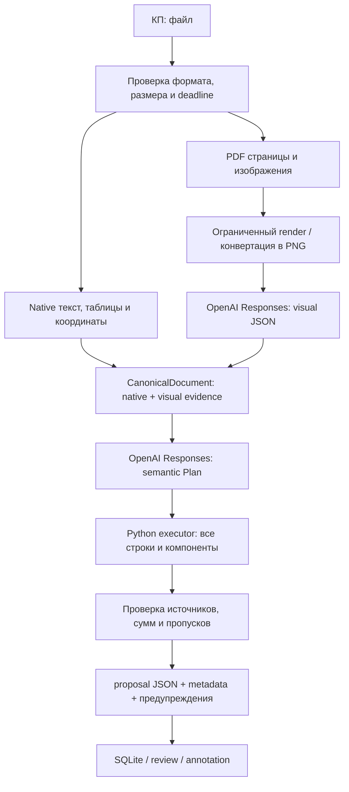

# Архитектура OpenAI API — 2026-10-07

Цель: быстро извлекать коммерческие предложения без локального model runtime и сохранять проверяемый источник каждого значения. OpenAI читает визуальный документ и определяет смысл полей; Python отвечает за полное применение mapping, числа, арифметику, хранение и evidence. Отсутствие реквизита в КП является нормальным результатом, а отказ API — отдельным состоянием.

## Поток обработки

Рабочий Compose содержит только `frontend` и `backend`. В backend нет Paddle, Torch, Transformers, llama.cpp и Tesseract. `PyMuPDF` выполняет чтение PDF и render, native parsers читают DOCX/Excel. Эти библиотеки не являются локальными OCR/LLM моделями.

Backend имеет исходящий HTTPS доступ для OpenAI; наружу опубликован только frontend на `127.0.0.1:8080`. Прежний volume `proposal_data` сохраняет имя и SQLite данные. `APP_PASSWORD`, `APP_SECRET` и `COOKIE_SECURE` остаются доступными настройками защиты.

## Визуальное чтение

`VISION_PDF_MODE=always` передаёт все PDF-страницы в OpenAI Vision, включая PDF с текстовым слоем. Native текст и числа сохраняются для проверки распознавания и fusion. Ограниченная параллельная обработка страниц сохраняет порядок источников.

PNG/JPG/JPEG/WEBP/BMP/TIF/TIFF и встроенные растровые изображения DOCX/XLSX читаются visual API после декодирования в PNG. EXIF orientation исправляется перед передачей, TIFF frames обрабатываются отдельными страницами. Native таблицы DOCX/XLSX сохраняют точную структуру; каждая картинка сохраняет имя media source. Повторяющиеся Office media дедуплицируются по SHA-256.

Исходный растр ограничен 40 миллионами пикселей и общим лимитом страниц. Неподдерживаемые Office media, включая векторные изображения, явно помечаются как непрочитанные. `xlrd` не извлекает картинки бинарного XLS: такой файл получает предупреждение об ограничении visual review, для картинки требуется XLSX/PDF.

Responses получает изображение и строгую JSON Schema для блоков/таблиц. Модель должна переписывать видимый текст, сохранять порядок строк и колонок, отмечать нечитаемое и не достраивать реквизиты по шаблону. Ограничение `VISION_MAX_PAGES` и неполное чтение отражаются в routing; `used=true` не доказывает покрытие всех страниц.

`VISION_RENDER_DPI=144`, `VISION_MAX_SIDE=2400` и `OPENAI_VISION_MAX_OUTPUT_TOKENS=14000` ограничивают размер запросов и ответов. Эти значения являются стартовыми настройками проекта: мелкий текст и насыщенные таблицы нужно оценивать по реальным документам. Обрезанный ответ не считается успешно распознанной страницей.

## Semantic Plan и защита от выдуманных данных

`SEMANTIC_MODEL_MODE=always` включает OpenAI semantic review каждого КП. `OPENAI_MODEL=gpt-5-mini` — текущий default; `OPENAI_VISION_MODEL` может отдельно задавать visual модель и по умолчанию использует ту же. Обе задачи проходят через Responses API и Structured Outputs. Название `local_model.py` в совместимом модуле не означает наличие локального inference.

Вместо генерации тысяч item objects модель получает source cells, реквизиты, headers, ограниченные sample rows, bounds таблицы и идентификаторы колонок. Она возвращает компактный Plan: поля с source ID/quote, mapping, диапазоны строк, компоненты, альтернативы и issues. Python применяет mapping ко всем source строкам, включая не попавшие в sample rows.

Source-grounding проверяет существование ID, цитату в выбранной ячейке и допустимость типа значения. Название поставщика нельзя получить из произвольного описательного абзаца, дату/номер — из суммы, а отсутствующее значение — из «типичных» условий договора. Unknown fields сохраняют исходные label/value и evidence.

Отсутствующие реквизиты остаются пустыми, отсутствующие quantity/unitPrice — `null`. Ноль является допустимым напечатанным значением. Компонентная услуга не получает искусственное количество `1`. Если документ содержит альтернативные стоимости, они остаются отдельными; случайный единый `documentTotal` не выбирается.

Python проверяет неотрицательные конечные числа, даты, quantity × unitPrice, суммы компонентов и document total. Вычисленный агрегат сопровождается формулой и ссылками; напечатанный итог и расхождение не исправляются молча. Speculative model issues не становятся проверенными фактами.

## API transport, задержка и ограничения

Общий клиент использует reuse HTTP connections, серверный `OPENAI_API_KEY`, `store: false`, ограниченную параллельность и bounded повтор HTTP 429/5xx. Transport timeout не повторяется автоматически: запрос мог уже выполняться у провайдера. Ошибки ключа и schema validation не скрываются повторами; 429, включая quota, получает ограниченное число повторов и понятную ошибку.

`OPENAI_TIMEOUT_SECONDS=120` задаёт бюджет API вызова, включая ожидание concurrency slot и повторные HTTP попытки; `OPENAI_MAX_RETRIES=2` ограничивает число повторов. Все запросы учитывают общий deadline `EXTRACTION_TIMEOUT_SECONDS=300`. Ожидание worker отдельно ограничено `EXTRACTION_QUEUE_WAIT_SECONDS=120`; очередь не обещает, что суммарное время ответа всегда меньше processing deadline.

`EXTRACTION_WORKERS=3` — pool процессов; `EXTRACTION_QUEUE_LIMIT=8` ограничивает сумму активных и ожидающих уникальных jobs, включая три работающих документа. Одинаковые запросы объединяются в один job. `OPENAI_MAX_CONCURRENCY=4` и `OPENAI_VISION_CONCURRENCY=3` являются ограничениями внутри worker: общий API поток нескольких документов может быть больше. При увеличении этих настроек необходимо учитывать rate limits, память и P95 задержку.

Cache учитывает SHA-256 файла и настройки извлечения. Ключи и ошибки не возвращаются пользователю в виде secret values. Завершённый результат может повторно использоваться; failed/partial visual или незавершённый semantic review не кешируются как успешное извлечение.

## Ошибки, evidence и честная диагностика

Без `OPENAI_API_KEY` `POST /api/extract` возвращает `503` с явной инструкцией настроить `.env`. Health описывает конфигурацию без платного inference request; `configured=true` подтверждает наличие ключа, а не корректность квоты или точность модели.

Если API недоступен после native чтения, доступный native результат может быть возвращён как явно непроверенный частичный результат с warnings и `reviewCompleted=false`. Такой fallback не означает выполненный OpenAI review. Для чистого скана/изображения без распознанного текста полноценного источника нет: ошибка/диагностика сообщает невозможность чтения, а поля не выдумываются.

`metadata.fieldEvidence`, `sourceCells`, `canonicalDocument`, `routing`, `warnings`, `verification` и раздельные timings позволяют проследить источник. Native ячейки хранят координаты документа/листа/строки/колонки; visual ячейки — страницу и происхождение распознавания.

Exact match по visual source означает совпадение с распознанным canonical текстом. Это не независимое подтверждение, что OCR правильно прочитал пиксели. Confidence остаётся эвристикой источников, структуры и арифметики; качество относительно изображения требует human-reviewed проверки.

Разница состояний сохраняется в UI: «нет данных в КП», «не удалось прочитать», «частичный результат», «требуется проверка» и «проверка завершена» имеют разный смысл. Работащее HTTP приложение и config readiness не заменяют реальное извлечение.

## Данные и ключи

Секрет хранится в ignored `.env` backend и никогда не задаётся через `VITE_*`. Frontend получает результат извлечения, а не API credential. Полный `docker compose config` может раскрыть env; для проверки используйте `config --services` или выводите только безопасные выбранные поля.

Документы и изображения отправляются OpenAI. `store: false` отключает хранение Response для последующего retrieval; применимые служебные retention policies описаны в [официальной документации о данных](https://platform.openai.com/docs/guides/your-data). Миграция API не означает локальную обработку конфиденциальных документов.

Ссылки на контракт: [Responses API](https://platform.openai.com/docs/api-reference/responses), [Images and vision](https://platform.openai.com/docs/guides/images-vision), [Structured Outputs](https://platform.openai.com/docs/guides/structured-outputs).

## Архив и критерии приёмки

Существующие `training/`, `private_training/`, `models/`, `services/vision/`, разметки и база сохранены. Они являются архивом local inference/training и не участвуют в активном Compose. Пустые GPU/trained overlays сохраняют совместимость старых команд без запуска локальных моделей. Исторические документы сохранены отдельно: [v2 architecture](archive/ARCHITECTURE-v2.md), [v2 validation](archive/VALIDATION-v2.md).

Необходимые проверки миграции: mocked HTTP transport/vision/semantic, source-grounding, порядок и полное покрытие строк, missing/null значения, API failures, bounded queue/deadline, native parsers, annotation/export, production frontend build и Compose config. После настройки реального ключа требуется live smoke на native PDF, скане, изображении, DOCX/Excel и human-reviewed benchmark разнообразных КП. Автотесты без платного API подтверждают implementation contract, но не измеряют OCR accuracy или реальную OpenAI latency.

Фактическая проверка текущей версии: [VALIDATION.md](VALIDATION.md).
