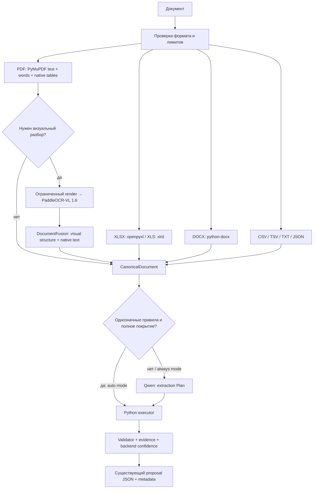

# Архитектура извлечения коммерческих предложений

Приоритет версии 2 — качество извлечения из разных документов, сохранение
источников и явное отображение неполного результата. Python формирует позиции и
проверяет числа; Vision восстанавливает визуальную структуру; semantic-модель
определяет смысл реквизитов и колонок.

## Что показал аудит существующего проекта

Рефакторинг выполнен поверх существующих модулей, HTTP API, схемы КП и рабочего
места разметки. Важно различать два состояния исходного кода: сохранённый `HEAD`
ещё содержал Tesseract/image pipeline, а рабочая копия перед этим изменением уже
содержала предыдущие native-only/rules-first изменения. Эти локальные изменения
были сохранены, а не заменены версиями из `HEAD`.

| Область | Наблюдение в исходном коде | Решение версии 2 |
| --- | --- | --- |
| `extraction.py` | Плоский `Source.cells`; PDF таблицы и строки собирались PyMuPDF и координатными эвристиками. Каждая ячейка найденной таблицы получала bbox всей таблицы. В исходном `HEAD` сканы проходили Tesseract. | Иерархический canonical документ, координаты слов и отдельных ячеек, отдельный визуальный адаптер, сохранение native текста. |
| `universal.py` | Уже существовали mapping-планы, source-grounding и Python executor. В `HEAD` layout определялся отдельными вызовами по блокам, реквизиты — батчами, затем могли запускаться проверки. Предыдущая рабочая копия уже сокращала это до rules-first fallback. | Сохранён executor; один компактный semantic `Plan` на документ при необходимости. Модель не возвращает все позиции. |
| `local_model.py` | В `HEAD` endpoint `http://model:8081` и ID `local` были фиксированы, baseline — Qwen2.5-1.5B. | Configurable `SemanticModelService`, baseline Qwen3-4B-Instruct-2507, schema-constrained JSON и независимая проверка плана. |
| `pipeline.py` | Рабочий subprocess, deadline, ограниченная очередь и кеш уже существовали. | Сохранены; добавлены routing, canonical hierarchy, раздельные timings и явное незавершённое visual review. |
| `rules.py` | Было консервативное преобразование чисел, evidence и проверка арифметики. | Сохранены; улучшены компоненты, альтернативные стоимости, unknown fields и обоснование confidence. |
| Frontend | Уже показывал поля КП, позиции, evidence, предупреждения и исходный документ в разметке. | Контракт КП сохранён; добавлены visual routing, provenance, объяснение эвристической confidence и альтернативные компоненты. |
| Training/annotation | Были оригиналы, версии разметки, проверка цитат и групповые train/val/test splits. | Совместимость старых Layout/Requisites сохранена; добавлен экспорт production semantic Plan. |

Исходная проблема была не только в размере Qwen: ошибка геометрического разбора
становилась для text-only модели единственной доступной структурой. Поэтому
увеличение text-модели само по себе не заменяет визуальный слой.

## Поток обработки



Vision не получает задачу сформировать `proposal`. Semantic Qwen не получает
изображений и не выполняет OCR. Ни один из model services не является источником
точных числовых значений без ссылки на canonical source.

## CanonicalDocument и совместимость

`backend/canonical.py` определяет `CanonicalDocument`, `CanonicalPage`,
`CanonicalBlock`, `CanonicalTable`, `CanonicalRow`, `CanonicalCell` и `NativeWord`.

Иерархия и плоский список используют одни и те же объекты ячеек. `Source` и `Cell`
остаются совместимыми именами. Существующие consumers используют
`source.cells`, `cell.block`, `cell.row`, `cell.cell`, `source.text()` и
`source.public()`; сохранён и вызов `Cell(**saved_payload_cell)`.

У ячейки есть стабильный ID, точный текст, файл, block ID, строка, колонка,
страница/лист где применимо, bbox, provenance, reading order, rowspan/colspan и
ссылка `merged_into` для пустого продолжения объединённой ячейки. Объединённый
текст хранится один раз в origin cell. Идентификатор табличного блока совпадает с
`CanonicalTable.id` и `cell.block`.

Публичное поле колонки сохраняет старое имя `cell`; внутреннее свойство
`column` возвращает то же значение. Новые source attributes сериализуются в
snake_case (`source_method`, `reading_order`, `vision_agreement`) для совместимости
с сохранёнными annotation payloads. `fieldEvidence.sourceId` ссылается на тот же ID.

`metadata.canonicalDocument` содержит страницы, блоки и ссылки таблиц на cell IDs.
`metadata.sourceCells` содержит исходный плоский список. PNG и все PDF words не
копируются в HTTP metadata: `source.native_words` нужен fusion внутри backend.

Bbox записывается в PDF points отображаемой страницы, с началом координат слева
сверху. Native words/cells преобразуются через `page.rotation_matrix`, чтобы
PDF rotation 90/180/270 градусов совпадал с render координатами; исходная rotation
сохраняется в canonical page. Pixel bbox официального visual результата пересчитывается по фактическим
размерам render. Для DOCX/XLSX геометрия отсутствует, когда её нет в native формате;
у Excel сохраняются sheet и адрес вроде `B17`.

## Native parsers и routing

| Формат | Основной источник | Когда используется Vision |
| --- | --- | --- |
| XLSX | openpyxl, read-only/data-only; фактические XML строки, merges, sheet/cell coordinates | Не используется. |
| XLS | xlrd | Не используется. |
| DOCX | python-docx: body order, paragraphs, tables, merges, header/footer parts | Пока не используется; PDF rendering DOCX оставлен точкой расширения. |
| PDF | PyMuPDF native text, word bbox, native table cell bbox | Для сканов, плохого native текста и сложного/неоднозначного layout. |
| CSV/TSV/TXT/JSON | Native текст/структура | Не используется. |

XLSX не полагается на необязательный или устаревший `<dimension>`: парсер читает
реальные строки и проверяет ограничения во время чтения. Формулы берутся из
сохранённого cache; backend не пересчитывает Excel и не заполняет пустой cache.
Merge declarations читаются из worksheet XML без второй полной загрузки workbook.

PDF routing — прозрачные эвристики, а не модельная оценка качества. Обязательный
visual review включается для недостаточного/повреждённого native текста,
изображений с коротким native слоем, нескольких таблиц, объединённых/многострочных
заголовков, большого числа колонок и неоднозначных borderless numeric tables.
Простой PDF с нормальным текстом или небольшой однозначной таблицей остаётся native.
`VISION_PDF_MODE=always` принудительно требует визуальный разбор всех PDF страниц.

Native borderless таблица распознаётся как геометрический кандидат только при
совпадении колонок соседних строк. Бизнес-смысл этих колонок определяют правила
или semantic Plan, а не координатный parser.

Render defaults проекта: `VISION_RENDER_DPI=144`, `VISION_MAX_SIDE=2400`,
`VISION_MAX_PAGES=50`. Это выбранные ограниченные defaults проекта, а не заявленные
официальные рекомендуемые DPI PaddleOCR. Масштаб учитывает DPI и max side, renderer
использует RGB и не увеличивает изображение до экстремальных размеров. Число
страниц также ограничивает общий `MAX_PAGES`.

## Visual adapter и официальный API

`backend/vision.py` задаёт `DocumentVisionService.analyze_pages()` и DTO
`RenderedPage`, `VisionResult`, `VisionPage`, `VisionBlock`. Backend обращается к
`create_vision_service()`, а не импортирует Paddle inference в каждый parser.

Официальный pipeline развёрнут в отдельном сервисе `services/vision`:

```python
from paddleocr import PaddleOCRVL

pipeline = PaddleOCRVL(
    pipeline_version="v1.6",
    device="cpu",                 # deployment override: gpu:0
    use_layout_detection=True,
    use_doc_orientation_classify=False,
    use_doc_unwarping=False,
    use_queues=False,
)
predictions = pipeline.predict(input=images, use_chart_recognition=False)
```

Зависимости: `paddleocr[doc-parser]==3.6.0`, PaddlePaddle CPU/GPU `3.2.1`.
Адаптер читает официальный `Result.json` → `res.parsing_res_list`:
`block_label`, `block_content`, `block_bbox`, `block_order`. Табличный HTML
превращается в canonical rows/cells с учётом colspan/rowspan.

Cell boxes используются только если реально пришли в результате. Pipeline
может возвращать table HTML без геометрии каждой ячейки; эти координаты не
выдумываются. Orientation/unwarping отключены, чтобы native и visual координаты
оставались в одной системе. Поддержка дополнительных преобразований самим VLM требует
явного inverse coordinate mapping; текущая реализация этого не делает.

HTTP `/analyze` — собственная обёртка проекта вокруг официального Python API,
не заявленный endpoint PaddleOCR. Запросы содержат до четырёх PNG страниц,
анализ сериализуется lock. `/health` готов только после загрузки pipeline.
Backend сохраняет успешно обработанные предыдущие batch pages при последующей
ошибке. Автоматического повторного inference после HTTP ошибки нет.

API сверялся с [официальной документацией PaddleOCR-VL](https://www.paddleocr.ai/latest/en/version3.x/pipeline_usage/PaddleOCR-VL.html).

## DocumentFusion: точный текст и визуальные отношения

`backend/fusion.py` объединяет visual blocks с native документом по страницам,
регионам и ячейкам:

1. При наличии настоящего cell bbox берётся качественный native текст слов в этом
   регионе. Точность источника сохраняется, даже если Vision ошибся в цифре.
2. Без cell boxes используется соответствие native/visual grids, только если
   их размеры совпадают; физические PDF row offsets нормализуются относительно
   таблицы. Также возможен однозначный точный текстовый match в native регионе.
3. Если точное соответствие восстановить нельзя, сохраняется visual cell с
   `source_method=paddleocr-vl`; отсутствие native alignment явно диагностируется.
4. Native блоки вне принятых visual regions сохраняются. Неиспользованные слова
   внутри региона остаются отдельным source text и вызывают coverage warning.
5. Невалидный HTML не удаляет доступную native таблицу. После fusion IDs уникальны
   и детерминированы, пустые merge placeholders не дублируют origin text.

При сопоставленном native/visual расхождении сохраняется native текст и
`vision_agreement=false`; записывается `native_vision_conflict`. Условная проверка
качества native текста выявляет отсутствие текста, непечатные символы и replacement
characters; это эвристика, она не доказывает безошибочность каждого PDF glyph.

Невозможность восстановить cell alignment — существенное ограничение: блоковый
Vision bbox не равен точной геометрии всех его ячеек. Не назначаем равномерную
выдуманную сетку и не называем такой результат native-verified.

## Semantic Plan и Python executor

Baseline — [Qwen3-4B-Instruct-2507](https://huggingface.co/Qwen/Qwen3-4B-Instruct-2507),
Instruct-модель с Apache-2.0 license и GGUF deployment через llama.cpp. Конкретный
[Q4_K_M GGUF](https://huggingface.co/bartowski/Qwen_Qwen3-4B-Instruct-2507-GGUF)
занимает около 2.50 GB; RAM/VRAM дополнительно расходуют KV cache и runtime buffers,
поэтому размер файла не является полным требованием к памяти. Совместный GPU
запуск Vision и Qwen требует отдельной проверки на выбранном hardware.

`SemanticModelService` настраивается через `SEMANTIC_MODEL_URL/ID/NAME/ENABLED`
с совместимыми `LOCAL_MODEL_*` aliases. Endpoint OpenAI-compatible;
используется [schema-constrained JSON llama.cpp](https://github.com/ggml-org/llama.cpp/blob/master/tools/server/README.md),
после которого результат дополнительно проверяется Pydantic и Python executor.

Qwen получает metadata blocks, headers, несколько sample rows, полные row bounds,
column IDs, merged header сведения и source locations. В режиме `auto`
однозначный deterministic результат с покрытием строк может завершиться без LLM.
Неоднозначные/сложные случаи используют один production Plan request; режим
`always` требует semantic request, `disabled` оставляет Python rules.

Plan содержит source-grounded `fields`, column mappings, components,
`componentMode`, explicit aggregate columns, unknown columns и issues.
Модель не возвращает `items` или собственную confidence. Executor применяет
mapping ко всем canonical строкам в диапазоне, включая отсутствующие в sampleRows.
Oversized semantic context и truncated Plan явно отклоняются вместо скрытого
обрезания документа.

Цитата должна содержаться в выбранной ячейке; поле неизвестного типа должно иметь
исходный label. Дополнительно проверяются типы: сумма не может стать датой/номером,
произвольный описательный абзац — поставщиком. `sourceId`/table mappings outside
source отклоняются. Отсутствующие реквизиты остаются пустыми.

Альтернативные варианты не складываются. При additive components Python может
вычислить агрегат с формулой и ссылками на источники. Явно напечатанный aggregate
имеет приоритет, расхождение суммы компонентов остаётся предупреждением.

## Validator, evidence и частичный результат

Validator проверяет неотрицательное конечное quantity/price/amount, календарные
даты, quantity × unitPrice, компоненты и documentTotal. В итоговой проверке
учитываются явно напечатанные проценты/суммы скидки, VAT и delivery, с tolerances
для округления. Неоднозначные налоговые схемы не достраиваются типичными значениями.
Числа источника не исправляются молча.

`metadata.fieldEvidence` хранит исходную ячейку, excerpt, sourceId, location,
provenance и `verifiedInSource`; вычисленные поля — formula и contributing sources.
Exact match для OCR означает соответствие canonical распознанному тексту, а не
независимо измеренную правильность OCR относительно картинки.

Confidence считает backend: native provenance, exact source match, table structure,
semantic mapping, native/vision agreement и арифметические проверки. Это
`confidenceKind=heuristic`, а не измеренный процент точности. В API/UI доступны
`confidenceBasis`, warnings и раздельные timings.

Routing передаёт `mandatory`, `requested`, `used`, `available`, `status`,
`required_pages`, `processed_pages`, `reasons`, `issues`. `used=true` само по себе
не означает полное визуальное покрытие. Статусы `fallback`/`limited`, ошибки
структуры или несопоставленный текст оставляют review незавершённым.

Если обязательный Vision недоступен, текстовый PDF возвращает доступный native
результат с явным ограничением. Полностью сканированный PDF без usable Vision
получает понятную ошибку: источника для извлечения нет. Backend health и readiness
модельных сервисов различаются. Проверка headers/fields сама по себе не доказывает
полноту сложной таблицы.

## Разметка и обучение

Оригиналы, cell IDs, native/visual provenance, canonical hierarchy и routing
сохраняются в annotation payload. Preview и source cell selection остаются
основным workflow; подтверждённые field values обязаны быть точными source quotes.

Экспорт включает прежние `kp_*` Layout/Requisites datasets и новые `kp_plan_*`.
Новые examples используют тот же `PLAN_SYSTEM` и `plan_payload`, что production;
output содержит поля и mapping, а не сотни сгенерированных item objects.
Groups остаются в одном train/val/test split. Только human-reviewed, не
quarantined разметка попадает в export. Notes/issues ревьюера не становятся
неподтверждёнными model answers.

Этот text dataset обучает semantic слой; он не обучает Paddle visual recognition.
Развёртывание новой модели и fine-tuning не выполняются автоматически при загрузке
КП или экспорте. Training cutoff/context нужно согласовать с длиной plan examples.

## Проверки и оставшиеся границы

Unit/mock проверки покрывают canonical round-trip с сохранёнными annotation
cells, HTML merges, native numeric authority, row offsets, PDF cell coordinates,
bounded rendering, scan routing, native fallback и DOCX/XLSX provenance.
Существующие extraction и training regression tests также запускались.

На предоставленном DARA PDF проверено native чтение: одна страница, одна таблица,
83 cells, 253 native words, четыре услуги. Его merged/multirow headers правильно
включают обязательный Vision. Проверка с выключенным Vision доказывает native
fallback и честную диагностику, но не качество реального Paddle inference.

Adapter/mock tests не являются подтверждением качества реального inference.
Paddle weights в QA загружены, но полный Vision/fusion smoke пока не завершён.
Фактические результаты и ограничения: [VALIDATION.md](VALIDATION.md).

Пока отсутствуют DOCX page rendering и Vision routing для DOCX, standalone image
uploads, inverse mapping после дополнительных model orientation/unwarping
преобразований и измеренная accuracy confidence.
XLSX cached formulas не пересчитываются. Компактный table sampling может требовать
ручной проверки редкой смены схемы внутри большой таблицы; coverage diagnostics
опираются на source строки и не заменяют benchmark на разнообразных реальных КП.
